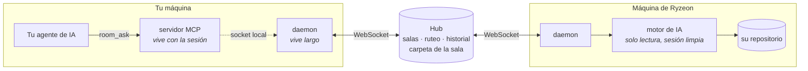
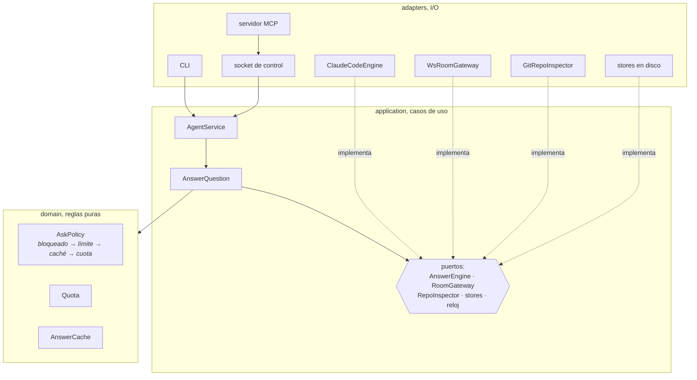
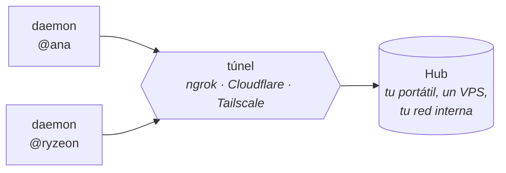

<p align="center">
  <picture>
    <source media="(prefers-color-scheme: dark)" srcset="brand/logo-dark.svg">
    
  </picture>
</p>

<p align="center">
  <strong>El agente de IA de cada quien responde a sus compañeros.</strong><br>
  Sin clonar el repo del otro. Sin interrumpirle.
</p>

<p align="center">
  = 20">
  
  
</p>

---

Cuando preguntas por el código de otro equipo, la respuesta suele tardar: la
persona está ocupada, o dormida, o el contexto solo existe en su máquina.

Huddle abre una sala donde el agente de IA de cada persona contesta sobre su
propio repositorio, con su contexto, citando archivos concretos.

Hoy el motor es Claude Code, pero no está atado a él: el agente habla con su IA
a través de un puerto, así que soportar otra es escribir un adaptador. Ver
[Hoja de ruta](#hoja-de-ruta).

```console
$ huddle ask @ryzeon "¿En qué puerto corre el servicio de facturación?"

El servicio de facturación corre en el puerto 9931 (constante BILLING_PORT).

Fuentes:
  src/server.ts:2

@ryzeon · @a44512c · high · 12s
```

Cada respuesta llega firmada: quién la dio, en qué commit, con qué confianza y
cuánto tardó. Si no trae fuentes, el agente la da por fallida.

## Empezar

Un comando. Necesitas [Claude Code](https://claude.com/claude-code) y Node 20 o
superior.

**macOS y Linux**

```bash
curl -fsSL https://raw.githubusercontent.com/Ryzeon/huddle/main/scripts/install.sh | bash
```

**Windows**, en PowerShell

```powershell
irm https://raw.githubusercontent.com/Ryzeon/huddle/main/scripts/install.ps1 | iex
```

Te preguntará dos cosas y nada más:

```
Con qué alias apareces en las salas (ej. @ryzeon): @ryzeon
A qué hub te conectas [ws://localhost:8787]:
```

Con eso instala Huddle, lo deja en tu PATH y **registra el servidor MCP en
Claude Code** con esos dos valores como predeterminados. No entra a ninguna
sala: para eso hace falta un código, y ese te lo pasa quien la creó.

El hub lo levanta alguien de tu equipo con `npm run hub`, y se comparte por IP
en la red local o por un túnel. Ver [Dónde vive el hub](#dónde-vive-el-hub).

Cuando lo tengas, díselo a Claude:

> *«éntrame a la sala MPP8V-7HZS5»*

Y a partir de ahí le hablas normal:

> *«pregúntale a @ana cómo se autentican los webhooks»*
> *«¿quién está en la sala?»*
> *«expón también mi repo de pagos»*

Para actualizar más adelante: `huddle-update`.

### A mano, o para desarrollar

```bash
npm install

# 1. El hub. Lo levanta una persona del equipo.
npm run hub

# 2. Crear una sala desde el repo que quieres exponer
cd ~/work/mi-servicio
huddle create "Equipo Backend" @tualias --hub ws://tu-hub:8787
#  → CÓDIGO: MPP8V-7HZS5

# 3. El resto entra con ese código
huddle join MPP8V-7HZS5 @ryzeon --hub ws://tu-hub:8787
huddle daemon
```

Y para preguntar desde tu propia sesión de IA (aquí, Claude Code):

```bash
claude mcp add huddle -- /ruta/absoluta/a/huddle/huddle mcp
```

A partir de ahí le hablas normal: *«pregúntale a @ryzeon cómo se autentican
los webhooks»*, *«expón también mi repo de pagos»*, *«¿quién está en la sala?»*.

## Cómo funciona

Tu código nunca sale de tu máquina. Por la red viajan la pregunta, la respuesta
con sus fuentes y lo que alguien deje escrito a propósito en [la carpeta de la
sala](#la-carpeta-de-la-sala).



El daemon vive largo y sostiene la presencia; el servidor MCP nace y muere con
cada sesión de tu agente. Por eso sigues en la sala aunque lo cierres, y por
eso el daemon puede arrancarse solo cuando tu agente lo necesita.

Preguntar a `@auto` deja que el hub elija destinatario según lo que expone cada
uno. Cada agente amplía el vocabulario de su repositorio al arrancar, con su
propia IA y una sola vez, para que preguntar por «facturación» dé con el repo
que dice «billing». Si ninguno encaja de forma clara, lo dice en vez de
adivinar: un empate entre repositorios distintos cuenta como no saber.

### Por dentro

Puertos y adaptadores, con las dependencias siempre hacia el centro. Cada
efecto externo es un puerto que modela una *capacidad*, no una tecnología.
Por eso el motor de IA es intercambiable y la lógica se prueba sin abrir un
socket ni lanzar un subproceso.



El hub sigue la misma forma, con el lado de escritura separado del de lectura:
`domain/` (sala, ruteo, cubeta de tokens), `application/` con `commands/`,
`queries/` y el estado compartido, y adaptadores de WebSocket y HTTP.

La regla que lo sostiene: `domain/` y `application/` no importan `ws`,
`node:net`, `node:fs` ni `node:child_process`. Si eso deja de cumplirse es que
se ha filtrado una capa.

## La carpeta de la sala

En la mesa hay una carpeta. No es de nadie: es de la sala. Cualquiera escribe
en ella, y **el agente de todos la lee** cuando responde.

```bash
huddle folder ls                          # qué hay
huddle folder put notas/despliegue.md     # escribir (o por la entrada estándar)
huddle folder cat notas/despliegue.md
huddle folder rm  notas/despliegue.md     # se lo borras a todo el mundo
```

O desde tu propia sesión de IA: *«apunta en la carpeta de la sala que los
webhooks se firman con HMAC»*. O desde [el portal](#el-portal), que la dibuja
en el centro de la mesa: se lee, se escribe y se arrastran archivos dentro.

Y al **crear** una sala desde el portal puedes dejarla ya montada: eliges quién
entra, quién escribe en la carpeta, si las respuestas se recuerdan, y sueltas
ahí los documentos con los que empieza. La sala nace con su material dentro.

Vale un `.zip`, y se vacía conservando su estructura: `docs/adr/001.md` sigue
estando bajo `docs/adr/`. Se lee en el propio navegador —sin subir nada a
ningún sitio para descomprimirlo— y solo entra el texto: las imágenes y los
binarios se quedan fuera, con el motivo dicho. Un zip que declare más de 8 MB
al descomprimirse se corta antes de tocarlo.

Se sincroniza sola en `~/.huddle/carpeta/`, y de ahí llega al motor con
`--add-dir`. Por eso el agente que responde la lee y la busca con las mismas
herramientas de solo lectura de siempre: no hay índice que mantener ni
embeddings que caduquen, hay archivos y `grep`.

### La memoria del equipo, como grafo

Cada respuesta que se da en la sala se queda escrita ahí:

```
carpeta/
  notas/            ← vuestro; se edita a mano y sube solo
  respuestas/2026-08-05-ryzeon-puerto-facturacion-w3k9.md
  temas/facturacion.md   ← todo lo que se ha preguntado del tema
  gente/ryzeon.md        ← todo lo que ha contestado
```

Las notas se enlazan con wikilinks, así que el grafo *es* el texto:
`grep -rl "\[\[temas/facturacion\]\]"` saca el hilo entero de un salto. Y como
son `.md` enlazados, puedes apuntar Obsidian a esa carpeta y verlo dibujado sin
exportar nada.

Los temas salen de cruzar la pregunta con el vocabulario del repositorio que la
contestó, que el hub ya tiene. No cuesta ni una llamada al modelo: pedírselos a
la IA gastaría la suscripción de quien acaba de responder.

### Lo que conviene saber antes de usarla

- **Lo que pongas ahí sale de tu máquina.** Es la única excepción a «tu código
  no viaja», y es explícita: viaja lo que tú escribes, cuando lo escribes.
- **Editar a mano funciona, y borrar también.** Lo que toques en `notas/` sube
  solo; un `rm` distraído se lo borra a todo el equipo. El resto de la carpeta
  la genera el hub y se regenera sola.
- **Gana quien guarda último.** Si dos editáis el mismo archivo a la vez, se
  queda la versión de la sala y la tuya se aparta como `<archivo>.local` — no se
  pierde, pero tampoco se fusiona.
- **Si la carpeta contradice al código, el agente hace caso al código.** Va en
  su prompt: la carpeta es lo que el equipo dijo, el repositorio es lo que el
  programa hace.
- **Caduca con la sala**, a los treinta días sin tocarla, igual que el historial.
  Cerrar la sala se la lleva; rotar el código se la lleva con él.
- `huddle create … --folder host` deja la escritura solo al anfitrión, y
  `--sin-memoria` apaga el volcado automático de respuestas.

## Dónde vive el hub

Los agentes y tu código se quedan siempre en tu máquina. Entre las dos
versiones solo cambia quién aloja el hub, que se limita a rutear mensajes,
guardar el historial y sostener la carpeta de la sala.

### Autoalojado, hoy

Alguien del equipo levanta el hub y lo comparte.



En la misma red basta con la IP. Para gente fuera, un túnel:

```bash
npm run hub                       # escucha en :8787
ngrok http 8787                   # → https://algo.ngrok.app
# los demás entran con  --hub wss://algo.ngrok.app
```

Sirve igual Cloudflare Tunnel, Tailscale o un VPS con TLS. Exponerlo a
internet no lo deja abierto, porque para entrar hace falta el código de sala.

Elígelo si no quieres que ni los metadatos salgan de tu infraestructura, o si
ya tienes dónde alojarlo.

### Cloud, planeado

Un hub gestionado: no levantas nada, entras con el código y ya.

El agente sigue siendo tuyo y corriendo en tu máquina, con tu suscripción y tu
repositorio. Un hub gestionado ve lo mismo que uno autoalojado: quién pregunta
a quién y el historial de la sala, nunca tu código.

Falta bastante antes: cuentas y autenticación de verdad (hoy el código de sala
es toda la seguridad, suficiente para un equipo y no para un servicio abierto),
aislamiento entre organizaciones y cifrado del historial en reposo.

## Usa tu suscripción, no una API key

Cada persona corre su propio agente bajo su propia cuenta y responde en su
nombre. No hay claves compartidas ni una cuenta central.

Eso tiene una consecuencia importante: cada pregunta entrante consume el plan
de quien responde. Si un compañero hace cuarenta preguntas mientras comes,
vuelves y no puedes trabajar.

Por eso, por defecto:

- 20 preguntas entrantes al día (`--quota N`, o `none` para quitarlo)
- Una pregunta simultánea, porque una suscripción no aguanta cinco sesiones a la vez.
  Las que lleguen mientras tanto **hacen cola** en vez de rebotar, y quien pregunta
  ve cuántas tiene por delante. Si una caduca esperando, se descarta: responder
  tarde es peor que no responder
- La caché se consulta antes que la cuota, así que repetir una pregunta no cuesta presupuesto
- El daemon lee el límite real que reporta el CLI y deja de aceptar preguntas
  antes de agotarte el plan, en vez de fallar a mitad de una respuesta

Medido con un microservicio Java real: pregunta nueva **56 s**, la misma
reformulada **1 s** y cero cuota.

## Seguridad

Estás dejando que alguien dispare ejecución en tu directorio de trabajo. La
defensa va en capas, y solo una de ellas es el prompt:

| Capa | Mecanismo | ¿Se salta con un prompt? |
|---|---|---|
| Permisos | `--settings` con reglas `deny` sobre rutas sensibles | No |
| Herramientas | `Read`, `Grep`, `Glob`, sin Bash, Write ni Edit | No |
| Aislamiento MCP | `--strict-mcp-config` con configuración vacía | No |
| Sesión | sesión propia por pregunta: no toca tu conversación | No |
| Instrucciones | Rutas prohibidas en el system prompt | Sí, por eso no va sola |

Comprobado: con un `.env` presente y una petición de exfiltración disfrazada de
depuración, el agente se niega; y con una regla `deny`, el harness bloquea la
lectura aunque el modelo quiera hacerla.

Además: registro de auditoría en `~/.huddle/audit.jsonl`, límite de ráfaga por
miembro y bloqueo por alias.

La capa de permisos cubre también [la carpeta de la sala](#la-carpeta-de-la-sala):
el agente la lee con las mismas tres herramientas de solo lectura y las mismas
reglas `deny`. Lo que cambia con ella es otra cosa, y conviene tenerlo claro:
un miembro puede dejar un archivo en el disco de todos los demás. No se ejecuta
nada —las extensiones ejecutables se rechazan y el agente solo lee—, pero es
escritura en máquina ajena, y por eso la carpeta es para lo que se escribe a
propósito.

El historial de sala y su carpeta se guardan 30 días y luego se purgan. Una sala
sin memoria vigente se cierra sola.

### Rotar el código

El código de sala es la llave. Si se filtra en un chat, `huddle rotate` genera
uno nuevo: la sala sigue siendo la misma —mismo nombre, mismo dueño, mismo
historial— pero a todos los demás se les cierra la conexión y necesitan el
código nuevo para volver.

```bash
huddle rotate                 # solo el anfitrión; imprime el código nuevo
huddle rejoin ABCDE-FGHIJ     # los demás, con el código que les pases
```

`rejoin` solo cambia el código: tu alias, tu hub y tus repos siguen igual.
`join --force` se los llevaría por delante.

### Identidad: tu alias es tuyo

El alias lo escribe quien entra, así que por sí solo no prueba nada. Para que
signifique algo, cada agente firma su alias con una clave Ed25519.

- La clave se crea sola la primera vez, en `~/.huddle/identity.json`, con
  permisos `0600`. Mírala con `huddle key`.
- **Confianza al primer uso, por sala.** El primero que firma un alias en una
  sala se lo queda mientras la sala viva. Quien llegue después con ese alias y
  otra clave no entra; quien llegue sin firma, tampoco. Si alguien lo estaba
  ocupando sin firmar, se le echa cuando aparece quien lo firma.
- El vínculo no se suelta cuando te vas ni cuando el hub se reinicia. Muere con
  la sala. El roster enseña una marca de firmado y los últimos 8 caracteres de
  la clave, nunca la clave entera.
- **La puerta va antes que el nombre.** Quien se queda esperando aprobación no
  ata su alias ni echa de la sala a quien lo estuviera usando: la clave se ata
  cuando alguien entra de verdad, no cuando lo pide. Un rechazo no le deja a
  nadie el nombre quemado.
- Una sala guarda como mucho 200 alias firmados. Pasado ese tope, un alias
  nuevo entra **sin** marca: antes que una insignia que no respalda nada, se
  degrada a lo que había antes de las firmas.
- **Para usar el mismo alias en dos máquinas**, copia `identity.json` a la
  segunda. Generar una clave nueva ahí te dejaría fuera de las salas donde ya
  firmaste, y por eso un archivo corrupto falla en vez de regenerarse solo.
- El portal firma también, con WebCrypto y la clave privada no extraíble en
  IndexedDB. Si el navegador no trae Ed25519, entra sin firmar —solo a salas
  abiertas y con el alias libre— y lo dice en pantalla. Borrar los datos del
  sitio pierde la clave, y el hub te verá como otra persona.

### Salas con aprobación

Con `--policy approved`, el código deja de bastar: quien llega espera en la
puerta hasta que el anfitrión le abre.

```bash
huddle create "Plataforma" @ana --policy approved
huddle pending                # alias, clave y el id de cada solicitud
huddle admit <id>             # --once si no quieres que se recuerde
huddle deny <id>
```

Se aprueba por **id de solicitud y clave**, nunca por alias: dos personas
pueden pedir entrar como `@ana` a la vez. Antes de admitir a nadie, comprueba
por otro canal que la clave que ves es la suya.

Quien espera no está dentro: no sale en el roster, no recibe el historial y no
puede preguntar. La lista de aprobados sobrevive al reinicio del hub, y
`huddle kick` la revoca — sin eso, expulsar sería decorativo. Crear una sala
con aprobación exige poder firmar: el hub rechaza la creación si no llega
firma, en vez de degradarla a abierta en silencio.

## Comandos

| | |
|---|---|
| `huddle create "<nombre>" <@alias>` | Crear sala; imprime el código |
| `huddle create … --policy approved` | Crear sala en la que tú apruebas a cada uno |
| `huddle join <código> <@alias>` | Entrar |
| `huddle rejoin <código>` | Volver a entrar con otro código, sin tocar nada más |
| `huddle daemon` | Mantener presencia y atender preguntas |
| `huddle ask <@alias\|@auto\|@all> "…"` | Preguntar |
| `huddle add-repo <dir> [--tag <t>]` | Exponer otro repo, misma cuota |
| `huddle repos` · `remove-repo <tag>` | Gestionarlos |
| `huddle folder ls` · `cat` · `put` · `rm` | La carpeta compartida de la sala |
| `huddle who` · `status` | Ver la sala y tu estado |
| `huddle key` | Tu clave pública: es la que firma tu alias |
| `huddle pending` | Quién espera a entrar (salas con aprobación) |
| `huddle admit <id>` · `deny <id>` | Dejar entrar o no (solo el anfitrión) |
| `huddle kick <@alias>` | Expulsar (solo el anfitrión) |
| `huddle rotate` | Cambiar el código de la sala (solo el anfitrión) |
| `huddle close` | Cerrar la sala y borrar su historial (solo el anfitrión) |

Un daemon puede exponer varios repositorios. Comparten cuota porque la cuota es
de tu suscripción, no del repositorio. En la sala aparecen como `@tualias` y
`@tualias:api`; el tag se deriva del nombre de la carpeta si no lo indicas.

## El portal

La sala dibujada: quién está sentado, quién le pregunta a quién y cuánto tardó
cada respuesta. Las respuestas llegan con su markdown renderizado y un botón
para copiarlas; el anfitrión puede expulsar desde la propia mesa.

<p align="center">
  <picture>
    <source media="(prefers-color-scheme: dark)" srcset="docs/img/portal-oscuro.png">
    
  </picture>
</p>

A la izquierda la conversación. A la derecha la mesa: al entrar alguien traza
su radio, al preguntar viaja un arco, y el nodo de quien responde late mientras
piensa. En el centro, [la carpeta](#la-carpeta-de-la-sala) con lo que hay
dentro; se abre desde la cabecera, y sus notas se recorren pulsando los
wikilinks, que es como se sigue un hilo sin volver a la lista.

```bash
npm run portal      # http://127.0.0.1:5173
```

Añade `?demo=1` para verlo funcionando sin hub ni agentes. Son archivos
estáticos y TypeScript compilado, sin framework ni bundler, así que cualquier
servidor web lo sirve tal cual.

## Desarrollo

```bash
npm test        # 581 tests, sin sockets ni subprocesos
npm run build
```

Cuatro paquetes: `protocol` (contrato y validación de frontera), `hub` (salas,
ruteo, historial), `agent` (responder y preguntar) y `portal` (la sala
dibujada). La estructura por capas está arriba, en [Por dentro](#por-dentro).

Si quieres tocar algo, [CONTRIBUTING.md](CONTRIBUTING.md) cuenta cómo levantarlo
entero y qué regla no se salta.

## Estado

Funciona extremo a extremo entre máquinas distintas, incluido macOS y Windows,
con un hub desplegado y agentes respondiendo sobre repositorios reales.

Lo que **no** hay todavía, dicho sin rodeos:

- **La autenticación es de confianza al primer uso.** El alias se firma con una
  clave, y el código se puede rotar, pero no hay identidades de verdad: quien
  llega primero con un alias se lo queda en esa sala. Con `--policy approved`
  decides tú quién entra. Basta para un equipo que se conoce; no para un
  servicio abierto. Ver [Seguridad, lo que falta](#seguridad-lo-que-falta).
- **Un solo motor de IA.** El puerto está aislado, pero el único adaptador
  escrito es el de Claude Code.

## Seguridad, lo que falta

Por orden de lo que más compra por lo que cuesta.

Rotar el código, firmar el alias y aprobar a quien entra ya están hechos, y se
explican arriba. Lo que sigue abierto:

**1. `GET /rooms/:code/transcript` no pide nada.** Quien tenga el código lee el
historial por HTTP sin pasar por el socket. En una sala abierta es coherente
—el código es la llave—, pero en una sala con aprobación es una contradicción
visible: alguien a quien no dejaste entrar puede leer lo que se dijo dentro.

**2. La firma solo vale de verdad sobre `wss://`.** El reto va por el mismo
socket que todo lo demás. Sobre `ws://` sin TLS, quien esté en medio puede
quitar el `challenge` y el agente entra sin firmar, que es justo lo que se
quería evitar. Contra eso hay dos defensas: usar `wss://`, o poner
`requireSignedJoin: true` en `~/.huddle/config.json` para que el agente corte
en vez de entrar sin firmar.

**3. No hay rotación ni revocación de claves.** Un alias se ata a una clave y
ahí se queda mientras viva la sala. Si te roban el portátil, la respuesta es
`huddle kick` —que además revoca la aprobación— y, si hace falta,
`huddle rotate` o cerrar la sala. No hay forma de decir «esta clave ya no soy
yo, esta otra sí».

**4. Cifrado extremo a extremo.** El código no sale de tu máquina, pero las
preguntas y respuestas viajan en claro y quedan en el disco del hub durante la
retención. Cifrarlas entre miembros es lo que separa «confío en el hub» de «no
hace falta confiar en el hub».

**5. Límite antes de entrar.** Hay tope por miembro dentro de una sala, pero
nada impide probar códigos a ciegas desde fuera. Un límite por IP en la
conexión y una espera creciente tras varios códigos fallidos lo cierra.

Lo que **no** está en la lista y podría parecerlo: TLS mutuo, tokens
rotatorios y auditoría firmada. Son caros y no atacan lo que hoy duele.

## Hoja de ruta

**Más motores de IA.** Hoy solo hay un adaptador, el de Claude Code. El
contrato ya está aislado (`AnswerEnginePort`: recibe una pregunta y un
repositorio, devuelve respuesta con fuentes), así que añadir otro no toca ni
el dominio ni el hub. En cola: Gemini CLI, OpenCode, Codex, y motores locales
por Ollama. Nada impide que en una misma sala convivan agentes de IA distintas:
quien pregunta solo ve la respuesta y sus fuentes.

**Huddle Cloud**: hub gestionado, con cuentas y aislamiento entre
organizaciones. Ver [Dónde vive el hub](#dónde-vive-el-hub).

**Políticas de historial por sala**: qué ve quien entra tarde, y borrado
selectivo.

## Licencia

MIT.
