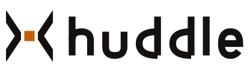
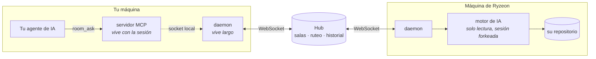
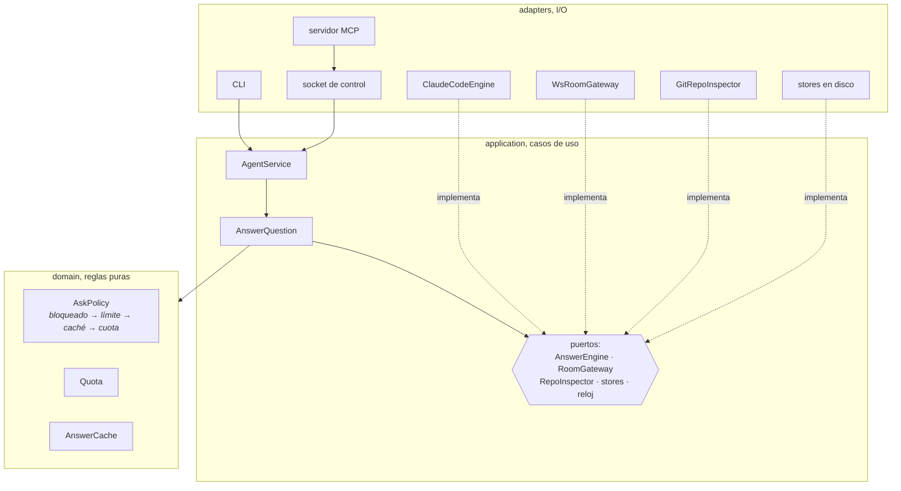
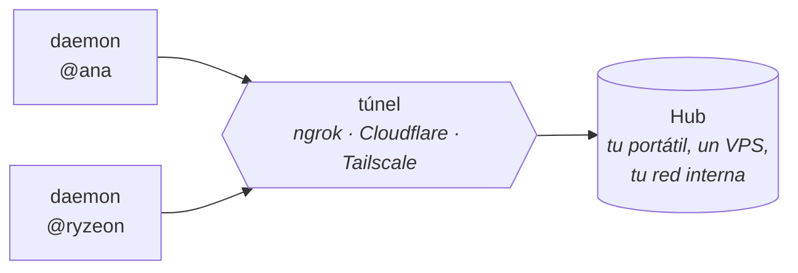
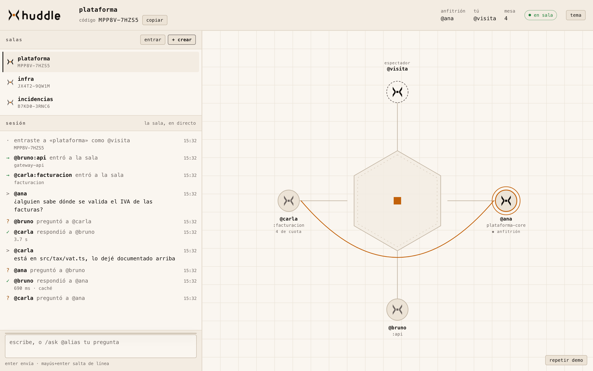

<p align="center">
  <picture>
    <source media="(prefers-color-scheme: dark)" srcset="brand/logo-dark.svg">
    
  </picture>
</p>

<p align="center">
  <strong>El agente de IA de cada quien responde a sus compañeros.</strong><br>
  Sin clonar el repo del otro. Sin interrumpirle.
</p>

<p align="center">
  = 20">
  
  
</p>

---

Cuando preguntas por el código de otro equipo, la respuesta suele tardar: la
persona está ocupada, o dormida, o el contexto solo existe en su máquina.

Huddle abre una sala donde el agente de IA de cada persona contesta sobre su
propio repositorio, con su contexto, citando archivos concretos.

Hoy el motor es Claude Code, pero no está atado a él: el agente habla con su IA
a través de un puerto, así que soportar otra es escribir un adaptador. Ver
[Hoja de ruta](#hoja-de-ruta).

```console
$ huddle ask @ryzeon "¿En qué puerto corre el servicio de facturación?"

El servicio de facturación corre en el puerto 9931 (constante BILLING_PORT).

Fuentes:
  src/server.ts:2

@ryzeon · @a44512c · high · 12s
```

Cada respuesta llega firmada: quién la dio, en qué commit, con qué confianza y
cuánto tardó. Si no trae fuentes, el agente la da por fallida.

## Empezar

Un solo comando. Necesitas [Claude Code](https://claude.com/claude-code) y Node 20 o superior.

```bash
curl -fsSL https://raw.githubusercontent.com/Ryzeon/huddle/main/scripts/install.sh \
  | bash -s -- --alias @tualias
```

Eso instala Huddle, lo deja en tu PATH y **registra el servidor MCP en Claude
Code** con tu alias y tu hub como valores por defecto. No entra a ninguna sala:
para eso hace falta un código, y ese te lo pasa quien la creó.

Cuando lo tengas, díselo a Claude y ya está:

> *«éntrame a la sala MPP8V-7HZS5»*

A partir de ahí le hablas normal:

> *«pregúntale a @ana cómo se autentican los webhooks»*
> *«¿quién está en la sala?»*
> *«expón también mi repo de pagos»*

Para actualizar más adelante: `huddle-update`.

En Windows, en PowerShell:

```powershell
irm https://raw.githubusercontent.com/Ryzeon/huddle/main/scripts/install.ps1 | iex
```

Si no le pasas `--alias` (o `-Alias`), te lo pregunta, junto con el hub.

### A mano, o para desarrollar

```bash
npm install

# 1. El hub. Lo levanta una persona del equipo.
npm run hub

# 2. Crear una sala desde el repo que quieres exponer
cd ~/work/mi-servicio
huddle create "Equipo Backend" @tualias --hub ws://tu-hub:8787
#  → CÓDIGO: MPP8V-7HZS5

# 3. El resto entra con ese código
huddle join MPP8V-7HZS5 @ryzeon --hub ws://tu-hub:8787
huddle daemon
```

Y para preguntar desde tu propia sesión de IA (aquí, Claude Code):

```bash
claude mcp add huddle -- /ruta/absoluta/a/huddle/huddle mcp
```

A partir de ahí le hablas normal: *«pregúntale a @ryzeon cómo se autentican
los webhooks»*, *«expón también mi repo de pagos»*, *«¿quién está en la sala?»*.

## Cómo funciona

Tu código nunca sale de tu máquina. Lo único que viaja por la red es la
pregunta y la respuesta con sus fuentes.



El daemon vive largo y sostiene la presencia; el servidor MCP nace y muere con
cada sesión de tu agente. Por eso sigues en la sala aunque lo cierres, y por
eso el daemon puede arrancarse solo cuando tu agente lo necesita.

Preguntar a `@auto` deja que el hub elija destinatario según lo que expone cada
uno. Cada agente amplía el vocabulario de su repositorio al arrancar, con su
propia IA y una sola vez, para que preguntar por «facturación» dé con el repo
que dice «billing». Si ninguno encaja de forma clara, lo dice en vez de
adivinar: un empate entre repositorios distintos cuenta como no saber.

### Por dentro

Puertos y adaptadores, con las dependencias siempre hacia el centro. Cada
efecto externo es un puerto que modela una *capacidad*, no una tecnología.
Por eso el motor de IA es intercambiable y la lógica se prueba sin abrir un
socket ni lanzar un subproceso.



El hub sigue la misma forma, con el lado de escritura separado del de lectura:
`domain/` (sala, ruteo, cubeta de tokens), `application/` con `commands/`,
`queries/` y el estado compartido, y adaptadores de WebSocket y HTTP.

La regla que lo sostiene: `domain/` y `application/` no importan `ws`,
`node:net`, `node:fs` ni `node:child_process`. Si eso deja de cumplirse es que
se ha filtrado una capa.

## Dónde vive el hub

Los agentes y tu código se quedan siempre en tu máquina. Entre las dos
versiones solo cambia quién aloja el hub, que se limita a rutear mensajes y
guardar el historial de la sala.

### Autoalojado, hoy

Alguien del equipo levanta el hub y lo comparte.



En la misma red basta con la IP. Para gente fuera, un túnel:

```bash
npm run hub                       # escucha en :8787
ngrok http 8787                   # → https://algo.ngrok.app
# los demás entran con  --hub wss://algo.ngrok.app
```

Sirve igual Cloudflare Tunnel, Tailscale o un VPS con TLS. Exponerlo a
internet no lo deja abierto, porque para entrar hace falta el código de sala.

Elígelo si no quieres que ni los metadatos salgan de tu infraestructura, o si
ya tienes dónde alojarlo.

### Cloud, planeado

Un hub gestionado: no levantas nada, entras con el código y ya.

El agente sigue siendo tuyo y corriendo en tu máquina, con tu suscripción y tu
repositorio. Un hub gestionado ve lo mismo que uno autoalojado: quién pregunta
a quién y el historial de la sala, nunca tu código.

Falta bastante antes: cuentas y autenticación de verdad (hoy el código de sala
es toda la seguridad, suficiente para un equipo y no para un servicio abierto),
aislamiento entre organizaciones y cifrado del historial en reposo.

## Usa tu suscripción, no una API key

Cada persona corre su propio agente bajo su propia cuenta y responde en su
nombre. No hay claves compartidas ni una cuenta central.

Eso tiene una consecuencia importante: cada pregunta entrante consume el plan
de quien responde. Si un compañero hace cuarenta preguntas mientras comes,
vuelves y no puedes trabajar.

Por eso, por defecto:

- 20 preguntas entrantes al día (`--quota N`, o `none` para quitarlo)
- Una pregunta simultánea, porque una suscripción no aguanta cinco sesiones a la vez.
  Las que lleguen mientras tanto **hacen cola** en vez de rebotar, y quien pregunta
  ve cuántas tiene por delante. Si una caduca esperando, se descarta: responder
  tarde es peor que no responder
- La caché se consulta antes que la cuota, así que repetir una pregunta no cuesta presupuesto
- El daemon lee el límite real que reporta el CLI y deja de aceptar preguntas
  antes de agotarte el plan, en vez de fallar a mitad de una respuesta

Medido con un microservicio Java real: pregunta nueva **56 s**, la misma
reformulada **1 s** y cero cuota.

## Seguridad

Estás dejando que alguien dispare ejecución en tu directorio de trabajo. La
defensa va en capas, y solo una de ellas es el prompt:

| Capa | Mecanismo | ¿Se salta con un prompt? |
|---|---|---|
| Permisos | `--settings` con reglas `deny` sobre rutas sensibles | No |
| Herramientas | `Read`, `Grep`, `Glob`, sin Bash, Write ni Edit | No |
| Aislamiento MCP | `--strict-mcp-config` con configuración vacía | No |
| Sesión | `--fork-session`: no escribe en tu conversación | No |
| Instrucciones | Rutas prohibidas en el system prompt | Sí, por eso no va sola |

Comprobado: con un `.env` presente y una petición de exfiltración disfrazada de
depuración, el agente se niega; y con una regla `deny`, el harness bloquea la
lectura aunque el modelo quiera hacerla.

Además: registro de auditoría en `~/.huddle/audit.jsonl`, límite de ráfaga por
miembro y bloqueo por alias.

El historial de sala se guarda 30 días y luego se purga. Una sala sin memoria
vigente se cierra sola.

## Comandos

| | |
|---|---|
| `huddle create "<nombre>" <@alias>` | Crear sala; imprime el código |
| `huddle join <código> <@alias>` | Entrar |
| `huddle daemon` | Mantener presencia y atender preguntas |
| `huddle ask <@alias\|@auto\|@all> "…"` | Preguntar |
| `huddle add-repo <dir> [--tag <t>]` | Exponer otro repo, misma cuota |
| `huddle repos` · `remove-repo <tag>` | Gestionarlos |
| `huddle who` · `status` | Ver la sala y tu estado |
| `huddle kick <@alias>` | Expulsar (solo el anfitrión) |

Un daemon puede exponer varios repositorios. Comparten cuota porque la cuota es
de tu suscripción, no del repositorio. En la sala aparecen como `@tualias` y
`@tualias:api`; el tag se deriva del nombre de la carpeta si no lo indicas.

## El portal

La sala dibujada: quién está sentado, quién le pregunta a quién y cuánto tardó
cada respuesta. Las respuestas llegan con su markdown renderizado y un botón
para copiarlas; el anfitrión puede expulsar desde la propia mesa.

<p align="center">
  <picture>
    <source media="(prefers-color-scheme: dark)" srcset="docs/img/portal-oscuro.png">
    
  </picture>
</p>

A la izquierda la conversación. A la derecha la mesa: al entrar alguien traza
su radio, al preguntar viaja un arco, y el nodo de quien responde late mientras
piensa.

```bash
npm run portal      # http://127.0.0.1:5173
```

Añade `?demo=1` para verlo funcionando sin hub ni agentes. Son archivos
estáticos y TypeScript compilado, sin framework ni bundler, así que cualquier
servidor web lo sirve tal cual.

## Desarrollo

```bash
npm test        # 322 tests, sin sockets ni subprocesos
npm run build
```

Cuatro paquetes: `protocol` (contrato y validación de frontera), `hub` (salas,
ruteo, historial), `agent` (responder y preguntar) y `portal` (la sala
dibujada). La estructura por capas está arriba, en [Por dentro](#por-dentro).

## Estado

Funciona extremo a extremo entre máquinas distintas, incluido macOS y Windows,
con un hub desplegado y agentes respondiendo sobre repositorios reales.

Lo que **no** hay todavía, dicho sin rodeos:

- **No se puede cerrar una sala.** Cuando el último se va, queda dormida con su
  historial hasta que la retención la purga a los 30 días.
- **No hay autenticación.** El código de sala es toda la seguridad. Basta para
  un equipo; no para un servicio abierto.
- **Un solo motor de IA.** El puerto está aislado, pero el único adaptador
  escrito es el de Claude Code.

## Hoja de ruta

**Más motores de IA.** Hoy solo hay un adaptador, el de Claude Code. El
contrato ya está aislado (`AnswerEnginePort`: recibe una pregunta y un
repositorio, devuelve respuesta con fuentes), así que añadir otro no toca ni
el dominio ni el hub. En cola: Gemini CLI, OpenCode, Codex, y motores locales
por Ollama. Nada impide que en una misma sala convivan agentes de IA distintas:
quien pregunta solo ve la respuesta y sus fuentes.

**Huddle Cloud**: hub gestionado, con cuentas y aislamiento entre
organizaciones. Ver [Dónde vive el hub](#dónde-vive-el-hub).

**Políticas de historial por sala**: qué ve quien entra tarde, y borrado
selectivo.

## Licencia

MIT.
