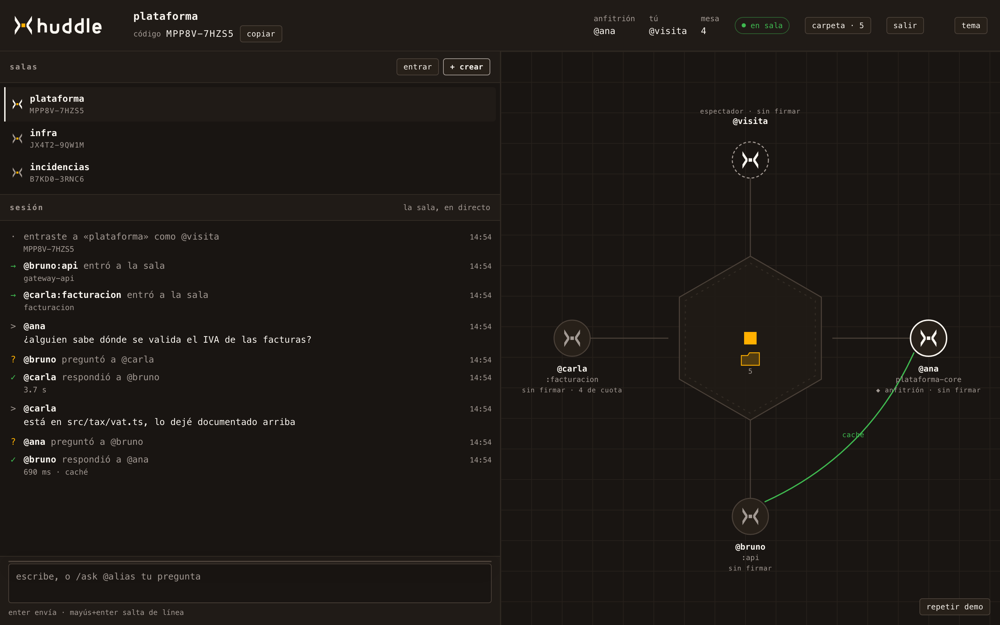

# @huddle/portal

La cara web de una sala: la mesa con quién está sentado, el chat de sesión y la
lista de salas a las que estás conectado.



El portal entra siempre como espectador (`viewer: true`). Mira, y puede
preguntar, pero nunca responde por ti: eso lo hace tu daemon, desde tu
repositorio y con tu cuenta.

De las preguntas ajenas se ve quién preguntó a quién y cuánto tardó, nunca el
contenido. El evento `activity` no lo trae. El texto de una respuesta llega solo
a quien preguntó.

## Arranque

```bash
npm install
npm run portal      # http://127.0.0.1:5173
```

Compila en watch y sirve. Sin bundler.

```bash
# una sesión completa de mentira, sin hub
open 'http://127.0.0.1:5173/?demo=1'

# contra un hub de verdad
open 'http://127.0.0.1:5173/?hub=ws://localhost:8787&sala=MPP8V-7HZS5&alias=@ana'
```

### Parámetros de la URL

| Parámetro | Para qué |
|---|---|
| `demo=1` | reproduce el guion de demostración; no toca la red ni `localStorage` |
| `velocidad=3` | el guion, tres veces más rápido |
| `instante=8000` | salta al estado del guion en ese milisegundo |
| `hub=ws://host:8787` | dónde está el hub |
| `sala=CÓDIGO` | a qué sala entrar |
| `crear=nombre` | crear una sala en vez de entrar a una |
| `alias=@ana` | con qué alias apareces |
| `tema=claro\|oscuro` | fuerza el tema |
| `estatico=1` | apaga las animaciones, para capturas deterministas |

La URL es el estado: una sala se puede pegar en un chat y funciona.

## Estructura

Puertos y adaptadores, igual que `hub` y `agent`.

```
domain/         geometría de la mesa y reducción de eventos. Ni DOM ni sockets.
application/    el puerto RoomFeed y el caso de uso (SessionStore).
adapters/       las dos implementaciones del puerto (WebSocket y guion) y las vistas.
composition/    main.ts, único sitio que decide cuál de las dos se usa.
```

Las vistas no saben si detrás hay un hub o un guion en memoria.

## Decisiones

**Sin framework y sin bundler.** TypeScript emite ESM con extensiones `.js`
explícitas, que es lo que ya exige `module: NodeNext`, y el navegador lo carga
tal cual. De `protocol` solo se importan tipos, que desaparecen al compilar. El
servidor de desarrollo es un `http.createServer` con `tsc --build --watch` al
lado. Cero dependencias de ejecución.

**El hub manda rosters, no eventos de entrada y salida.** «Entró @fulano» se
deduce comparando el roster nuevo con el anterior, en `session-state.ts`. Es lo
que más se rompe en silencio, y por eso es lo más probado.

**Las animaciones son un camino, no un estado.** Cada elemento se deja ya en su
aspecto final y `element.animate()` solo dibuja el trayecto, sin
`fill: forwards`. Los borrados van por temporizador y no por el evento `finish`.
Así, si el motor de animación no arranca (captura headless, pestaña en segundo
plano, `prefers-reduced-motion`), lo que se ve sigue siendo correcto en vez de
quedarse invisible.

**Los estados no se distinguen solo por color.** Espectador: disco sin relleno y
borde discontinuo. Anfitrión: borde grueso. Respondiendo: anillo. Fallo: trazo
más grueso y etiqueta «sin respuesta».

**Un solo ámbar**, según `brand/marca.md` §3. Se lo lleva la celda del centro de
la mesa, el arco de la pregunta viva, el cursor y el foco. El anfitrión y la
sala activa se marcan con contraste, no con un segundo acento.

**Las salas son memoria del navegador.** El hub no tiene cuentas: el código de
sala es la llave. «Mis salas» es una lista en `localStorage`, y por eso la
cabecera insiste con el botón de copiar. En demo se usa una lista en memoria.

**Tipografía.** La marca pide JetBrains Mono, pero traerla por red contradice lo
de no hacer peticiones fuera, y no metí un `.woff2` de 200 kB sin que nadie lo
pidiera. Se usa la pila mono del sistema, con JetBrains Mono declarada por si
está instalada.

## Capturas

```bash
npm run shots -w @huddle/portal     # con el portal levantado
```

Deja en `preview/` los estados que conviene mirar antes de tocar nada: los dos
temas con una pregunta en vuelo, el arco de vuelta, 1280×760, 860 px de ancho,
`prefers-reduced-motion` y la pantalla sin sala.

## Tests

```bash
npm test        # 88 de este paquete, sin navegador
```

Se prueba la lógica pura, no las animaciones: el reparto alrededor de la mesa y
la curva que esquiva el tablero, el diff del roster y las fases de `activity`,
cómo se redacta cada entrada del chat, las menciones y `/ask`, y que el guion de
demostración describa una sesión posible.

## Pendiente

- El hub no distingue quién expulsó a quién: a la sala solo le llega un
  `room_state` sin el que falta, así que el portal lo cuenta como «salió».
- `GET /rooms/:code/transcript` no se usa. Sería lo que rellena el chat al
  entrar a mitad de sesión, en vez de empezar en blanco.
- La mesa es un `role="img"` con etiqueta fija. Quien use lector de pantalla se
  entera por el chat (`role="log"`), no por la mesa. Debería exponer el roster
  como lista.
